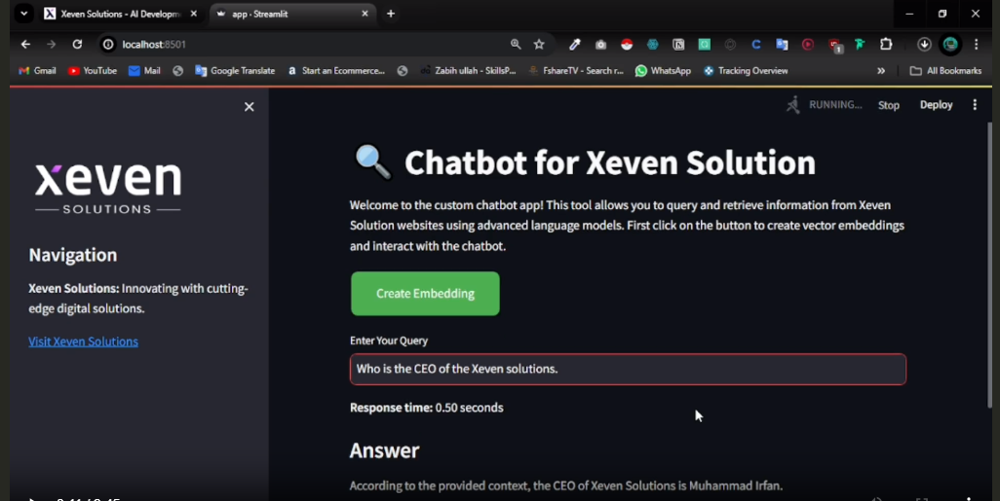

# RAG-Chatbot-using-ChatGroq


## Overview

This chatbot application allows users to query information from specific sections of the Xeven Solutions website, including the main page, About Us, Careers, and Portfolio sections. The chatbot is built using Streamlit for the frontend and integrates various AI technologies to provide accurate responses based on the website's content. Iused Groq api to access the Large language model. In this project i used Llama3-8b-8192 model. 

## Technologies Used

- **Streamlit**: A framework for creating interactive web applications.
- **Groq**: Utilized for AI capabilities, specifically using the Llama3 model.
- **LangChain**: For text processing and document retrieval.
- **FAISS**: For efficient similarity search and vector storage.
- **Google Generative AI**: For embedding generation.

## Setup and Usage

### Prerequisites

- Python 3.10+
- Required Python packages (listed in `requirements.txt`)
- API keys for Groq and Google Generative AI

### Installation

1. **Clone the repository:**
    ```sh
    git clone https://github.com/Zabih-khan/RAG-Chatbot-using-ChatGroq.git
    cd RAG-Chatbot-using-ChatGroq
    ```

2. **Create a virtual environment and install dependencies:**
    ```sh
    python -m venv venv
    source venv/bin/activate  # On Windows, use `venv\Scripts\activate`
    pip install -r requirements.txt
    ```

3. **Set up environment variables:**
    Create a `.env` file in the root directory of the project and add your API keys:
    ```env
    GROQ_API_KEY=your_groq_api_key
    GOOGLE_API_KEY=your_google_api_key
    ```

### Running the Chatbot

1. **Start the Streamlit app:**
    ```sh
    streamlit run app.py
    ```

2. **Navigate to the web interface:**
    Open your web browser and go to `http://localhost:8501`.

3. **Create Vector Embeddings:**
    Click the "Create Embedding" button to initialize the vector store database. This step processes the content from the specified URLs and creates embeddings for efficient retrieval.

4. **Enter Your Query:**
    Once you create embedding by clicking button then Use the text input to ask questions about the Xeven Solutions website. The chatbot will retrieve relevant information and display the response.

### Project Structure

- `app.py`: The main application file.
- `requirements.txt`: Lists the dependencies required for the project.
- `.env`: Environment variables for API keys (not included in the repo).
- `README.md`: This file.


